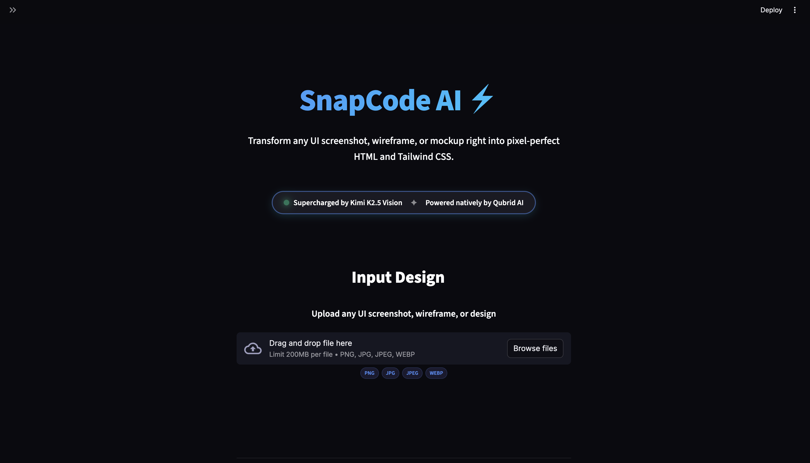
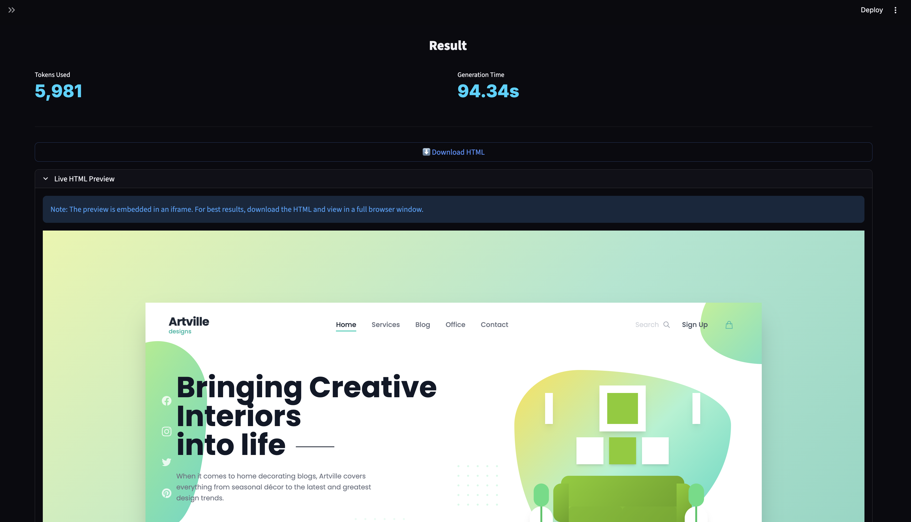
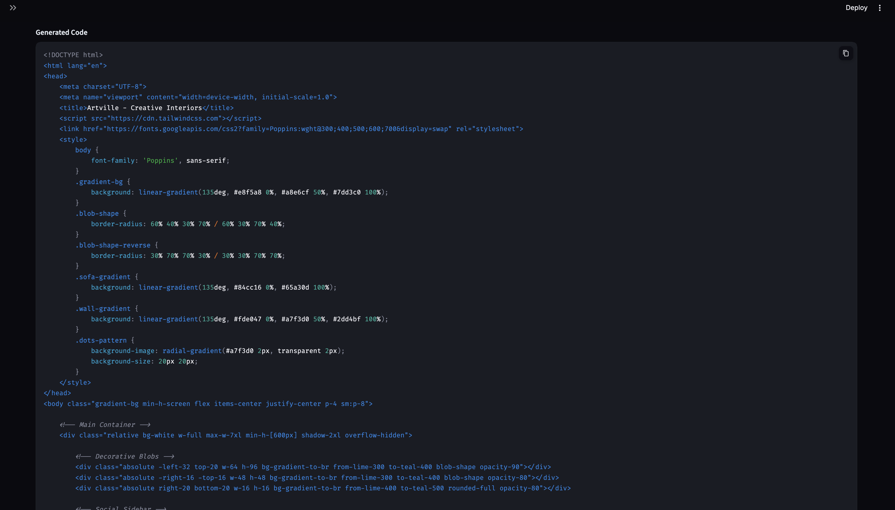
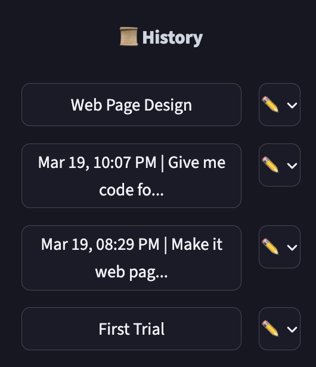
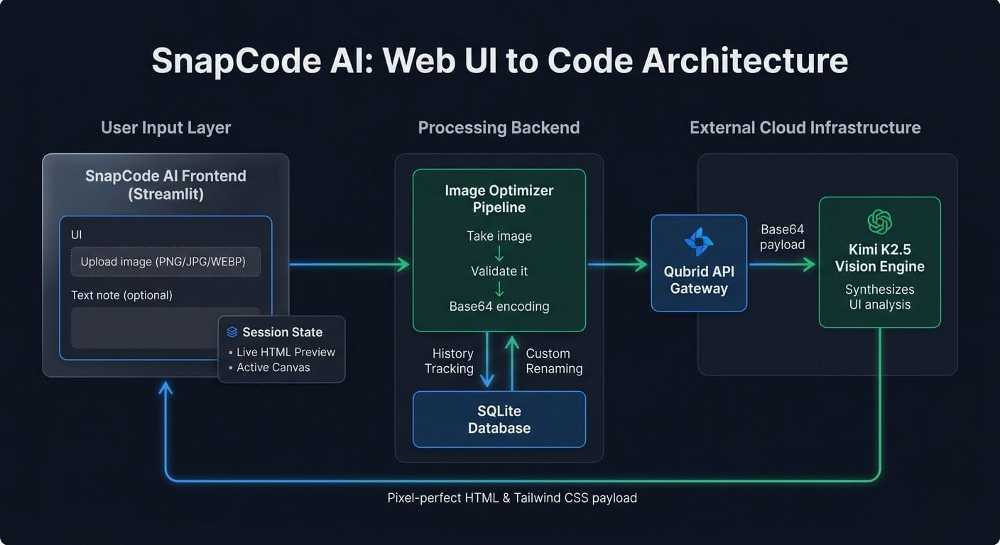

<div align="center">


# SnapCode AI ⚡

**Transform any UI screenshot, wireframe, or mockup right into pixel-perfect HTML and Tailwind CSS.**  
Upload a design. Get front-end code. In seconds.

<br>

[](https://www.python.org/)
[](https://streamlit.io/)
[](https://moonshot.cn/)
[](https://qubrid.com)
[](LICENSE)

</div>

## What it does

SnapCode AI acts as an instant AI-powered front-end developer. Simply upload an image of a user interface—whether it's a sleek Figma mockup, a wireframe, or a screenshot of an existing app—and the app writes the exact underlying HTML and Tailwind CSS to replicate it. 

- **Pixel-Perfect Code Generation** turning visuals directly into functional code.
- **Live HTML Previews** directly inside the app, complete with responsive iframes.
- **Persistent Sidebar History** tracking every generation, so you never lose past UI conversions.
- **Custom Renaming** for your history sessions, letting you build a categorized library of UI components.

Supercharged by **Kimi K2.5 Vision** and powered natively by [Qubrid AI](https://qubrid.com) infrastructure.

---

## 📸 Screenshots

### 🏠 Clean, Focused Interface


*A dark, perfectly-centered modern UI engineered specifically for streamlined image uploads.*

---

### 📥 Intuitive Uploads


*Drop any standard image, mockup, or wireframe. Add optional text notes to guide the AI's structural generation.*

---


### 👁️ Real-time Responsive Preview


*Immediately visualize the AI-generated UI rendered correctly inside a scalable wide-mode iframe.*

---

### ⚡ Live Code Generation


*Get complete syntax-highlighted HTML and Tailwind CSS code output instantly.*

---

### 📚 Interactive Sidebar History & Renaming


*All your past UI generations are seamlessly saved to an SQLite database. Click the pencil icon to dynamically rename any component!*

---

## 🏗️ System Architecture



*SnapCode AI processes images via Qubrid's API routing to Kimi K2.5 Vision, handles layout state natively, and tracks all history safely in a localized SQLite database.*

---

## ✨ Features

- **🖼️ Universal Input** - Supports full HD PNGs, JPGs, JPEGs, and WEBPs.
- **🎨 Tailwind Native** - Generates robust, inline-styled Tailwind utility classes out of the box.
- **📚 Complete History Engine** - Never lose a generation. Click a previous session to instantly reload the exact code and live preview.
- **✏️ Dynamic Name Tagging** - Rename complex timestamps into readable tags (e.g., "Login Card", "Nav Bar") with inline popovers.
- **🌓 Beautiful Aesthetic** - Pitch-dark, high-contrast, edge-to-edge UI leveraging Streamlit's new structural elements.

---

## 🎯 How It Works

1. **Upload** → Drop a standard image or wireframe into the intelligent upload zone.
2. **Context** → (Optional) Add a custom note specifying colors, states, or responsive behaviors.
3. **Generate** → Kimi Vision analyzes the structure and returns precisely-matched code.
4. **Preview** → Verify the raw code rendering via the interactive Live HTML Preview.
5. **Download** → Save the HTML file locally and deploy it immediately.

---

## 📁 Project Structure

```
snapcode-ai/
├── app.py                    # Main Streamlit application
├── frontend/
│   ├── __init__.py
│   ├── components.py         # UI element renderers (Header, Upload, Previews)
│   ├── styles.py             # Global custom CSS injections
│   └── assets/               # Screenshots and UI banners
├── backend/
│   ├── __init__.py
│   ├── api_client.py         # Kimi K2.5 Vision API integration
│   ├── db_utils.py           # SQLite database engine
│   └── image_utils.py        # Base64 encodings and PIL management
├── config/
│   ├── __init__.py
│   └── settings.py           # Environment variables & constants
├── .env.example              # API key template
├── .gitignore                # Git repository configurations
├── pyproject.toml            # Modern UV package management file
└── README.md                 # Project documentation
```

---

## 🛠️ Tech Stack

| Layer | Technology |
|-------|-----------|
| UI Framework | Streamlit + Custom CSS overrides |
| Vision Model | Kimi K2.5 Vision (moonshot-v1-32k-vision-preview) |
| API Infrastructure | [Qubrid AI](https://platform.qubrid.com) |
| Database | SQLite3 |
| Dependency Management | `uv` |

---

## 🚀 Quick Start

### Prerequisites

- Python 3.10+
- A [Qubrid AI](https://platform.qubrid.com) API key
- `uv` package manager (highly recommended)

### Installation

```bash
# 1. Clone repository
git clone https://github.com/aryadoshii/snapcode-ai.git
cd snapcode-ai

# 2. Install UV package manager
curl -LsSf https://astral.sh/uv/install.sh | sh
source ~/.zshrc  # Reload shell (or: source ~/.bashrc)

# 3. Create virtual environment
uv venv

# 4. Activate virtual environment
source .venv/bin/activate  # macOS/Linux
# OR: .venv\Scripts\activate  # Windows

# 5. Install dependencies
uv sync  # Uses uv.lock for exact versions

# 6. Set up API key
cp .env.example .env
nano .env  # Add your QUBRID_API_KEY inside

# 7. Run the application
streamlit run app.py
```
---

<div align="center">

  **Made with ❤️ by Qubrid AI**

</div>
